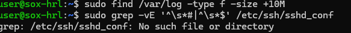

# 1. Connexió remota amb SSH

## 1.1 Comprovació de les adreces IP

Primer executem la comanda `ip a` per consultar les adreces IP de la màquina virtual.

En el resultat podem observar diferents interfícies de xarxa. La interfície `enp0s3` té l'adreça `10.0.2.15` i la interfície `enp0s8` té l'adreça `192.168.56.101`.

La interfície `enp0s8`, amb l'adreça `192.168.56.101`, correspon a la xarxa **host-only** i és la que utilitzarem per connectar-nos des de l'equip Windows.


## 1.2 Connexió SSH des de Windows

Des del terminal de Windows executem la comanda:

```bash
ssh user@192.168.56.101
```

Com que és la primera vegada que ens connectem a aquesta màquina virtual, apareix un missatge d'advertència indicant que l'autenticitat de l'equip no es pot establir.

Per continuar amb la connexió escrivim `yes`.


# 2. Actualitzacions del sistema

## 2.1 Simulació de l'actualització

Abans de realitzar l'actualització podem simular-la amb:

```bash
apt -s upgrade
```

La simulació indica que hi ha **13 paquets que es poden actualitzar**. També mostra que hi ha un paquet que encara no s'actualitza a causa d'una actualització gradual (*phasing*):

```text
rust-coreutils
```

Per tant, no es mostra cap conflicte de dependències que impedeixi continuar amb l'actualització.


# 3. Canviant el nom de l'equip

## 3.1 Comprovar el nom actual

Executem la comanda:

```bash
hostnamectl
```

En el resultat podem observar que inicialment el **Static hostname** és `server` i el **Icon name** és `computer-vm`.

També podem veure que el sistema és Ubuntu 26.04.1 LTS i que la màquina virtual funciona sobre VirtualBox.


## 3.2 Canviar el nom de l'equip

Canviem el nom de l'equip amb:

```bash
sudo hostnamectl set-hostname sox-hrl
```

Després intentem canviar el nom descriptiu amb:

```bash
sudo hostnamectl set-icon-name Servidor de Hector Rabasso
```

En aquest cas apareix l'error:

```text
Too many arguments.
```

Això passa perquè el nom descriptiu conté diversos espais. Per solucionar-ho, posem el nom entre cometes:

```bash
sudo hostnamectl set-icon-name "Servidor de Hector Rabasso"
```


## 3.3 Comprovar la nova configuració

Tornem a executar:

```bash
hostnamectl
```

Ara podem comprovar que el **Static hostname** ha canviat a:

```text
sox-hrl
```

I el **Icon name** és:

```text
Servidor de Hector Rabasso
```


## 3.4 Comprovar la comanda hostname

Executem:

```bash
hostname
```

El resultat és:

```text
sox-hrl
```

La comanda `hostname` mostra únicament el nom actual de l'equip.


## 3.5 Configuració del fitxer /etc/hosts

Editem el fitxer `/etc/hosts` amb:

```bash
sudo nano /etc/hosts
```

Afegim la correspondència entre l'adreça local i el nom complet de l'equip:

```text
127.0.0.1 localhost
127.0.1.1 sox-hrl.sox.test sox-hrl
```

D'aquesta manera, el sistema pot relacionar el nom de l'equip amb el domini `sox.test`.


## 3.6 Comprovar hostname i hostname -f

Primer executem:

```bash
hostname
```

El resultat és:

```text
sox-hrl
```

Després executem:

```bash
hostname -f
```

El resultat és:

```text
sox-hrl.sox.test
```

La diferència és que `hostname` mostra només el nom de l'equip, mentre que `hostname -f` mostra el **nom de domini complet (FQDN)**.


# 4. Canvi de la contrasenya de l'usuari

Per canviar la contrasenya de l'usuari actual executem:

```bash
passwd
```

El sistema ens demana la contrasenya actual i després la nova contrasenya dues vegades.

Finalment apareix el missatge:

```text
passwd: contraseña actualizada correctamente
```

Això confirma que la contrasenya s'ha canviat correctament.


# 5. Gestió de la instal·lació d'aplicacions

## 5.1 Cerca del paquet btop

Primer comprovem si el paquet `btop` existeix als repositoris amb:

```bash
apt search btop
```

El resultat mostra que el paquet `btop` està disponible als repositoris. També podem observar la seva versió:

```text
btop/resolute 1.4.6-2 amd64
```


## 5.2 Informació del paquet btop

Consultem la informació del paquet amb:

```bash
apt show btop
```

Entre la informació mostrada podem observar:

* **Package:** btop
* **Version:** 1.4.6-2
* **Priority:** optional
* **Section:** universe/utils
* **Origin:** Ubuntu
* **Installed-Size:** 1.804 kB
* **Download-Size:** 604 kB
* **Homepage:** https://github.com/aristocratos/btop

També s'indica que és un monitor de recursos de línia d'ordres que permet consultar informació del processador, memòria, discos, xarxa i processos.


## 5.3 Comprovació del funcionament de btop

Executem `btop` per comprovar que funciona correctament.

El programa mostra informació en temps real sobre la CPU, la memòria, els discos, la xarxa i els processos que s'estan executant.


## 5.4 Cerca del paquet lsd

Busquem el paquet `lsd` amb:

```bash
apt search lsd
```

El resultat mostra que el paquet `lsd` està disponible als repositoris.

La seva descripció indica que és una alternativa a la comanda `ls`, amb més opcions de formatació i colors.


## 5.5 Informació del paquet lsd

Consultem la informació del paquet amb:

```bash
apt show lsd
```

Podem observar que la versió disponible és `1.2.0-1` i que el paquet correspon a una alternativa moderna a `ls`.


## 5.6 Instal·lació de lsd

Instal·lem el paquet amb:

```bash
sudo apt install lsd
```

El sistema mostra que s'instal·laran `lsd` i les seves dependències:

```text
fonts-font-awesome
libgit2-1.9
```

Abans de continuar, el sistema demana confirmació amb:

```text
¿Continuar? [S/n]
```


## 5.7 Instal·lació d'Apache2

Instal·lem el servidor web Apache amb:

```bash
sudo apt install apache2
```

El sistema mostra el paquet `apache2` i les seves dependències.

En aquest cas s'indica que s'instal·laran 10 paquets i que es necessiten aproximadament 8,2 MB d'espai.

Abans de continuar, demana confirmació:

```text
¿Continuar? [S/n]
```


## 5.8 Comprovar l'estat d'Apache2

Una vegada instal·lat, comprovem l'estat del servei amb:

```bash
systemctl status apache2
```

El resultat mostra:

```text
Active: active (running)
```

Per tant, el servei Apache està actiu i funcionant correctament.


## 5.9 Desinstal·lació d'Apache2

Per eliminar Apache i els seus fitxers de configuració utilitzem:

```bash
sudo apt purge apache2
```

El sistema indica que s'eliminarà el paquet:

```text
apache2*
```

També mostra que s'alliberaran aproximadament 472 kB d'espai.

Abans de continuar, demana confirmació amb:

```text
¿Continuar? [S/n]
```


## 5.10 Comprovar que Apache2 ha estat eliminat

Després de desinstal·lar Apache executem:

```bash
systemctl status apache2
```

El sistema mostra:

```text
Unit apache2.service could not be found.
```

Això indica que el servei `apache2` ja no està disponible perquè ha estat desinstal·lat.


## 5.11 Instal·lació de Micro amb Snap

Instal·lem l'editor `micro` mitjançant Snap amb:

```bash
sudo snap install micro --classic
```

El resultat indica que s'ha instal·lat correctament la versió:

```text
micro 2.0.15
```


Després executem:

```bash
snap list
```

Podem observar que `micro` apareix a la llista de paquets Snap instal·lats.


## 5.12 Actualitzar Micro

Executem:

```bash
sudo snap refresh micro
```

Com que acabem d'instal·lar el paquet, no hi ha cap actualització disponible.

El sistema mostra:

```text
snap "micro" has no updates available
```


## 5.13 Desinstal·lar Micro

Finalment eliminem Micro amb:

```bash
sudo snap remove micro
```

El sistema confirma:

```text
micro removed
```

Després executem:

```bash
snap list
```

El paquet `micro` ja no apareix a la llista.


# 6. Configuracions d'hora, teclat i idioma

## 6.1 Comprovar la zona horària actual

Executem:

```bash
timedatectl
```

Inicialment, la zona horària configurada és:

```text
Etc/UTC
```

També podem observar que:

```text
System clock synchronized: yes
NTP service: active
```

Per tant, la sincronització horària està activa.


## 6.2 Configurar la zona horària

Canviem la zona horària a Madrid amb:

```bash
sudo timedatectl set-timezone Europe/Madrid
```

Després tornem a comprovar la configuració amb:

```bash
timedatectl
```

Ara la zona horària és:

```text
Europe/Madrid (CEST, +0200)
```

La sincronització del rellotge continua activa i el servei NTP també apareix com a `active`.


## 6.3 Configuració del teclat

Per configurar el teclat utilitzem:

```bash
sudo dpkg-reconfigure keyboard-configuration
```

Apareix l'assistent de configuració del teclat. En la pantalla mostrada podem seleccionar el model de teclat.

En aquest cas apareix seleccionada l'opció:

```text
Generic 105-key PC
```


## 6.4 Comprovar la configuració de l'idioma

Executem:

```bash
locale
```

La configuració regional del sistema és `es_ES.UTF-8`.

Podem observar que les diferents variables, com `LANG`, `LANGUAGE`, `LC_TIME`, `LC_MONETARY` i `LC_MESSAGES`, utilitzen aquesta configuració.


## 6.5 Reconfigurar les locales

Per configurar les localitzacions disponibles utilitzem:

```bash
sudo dpkg-reconfigure locales
```

Aquesta comanda inicia l'eina de configuració de les locals del sistema.


# 7. Explorant arxius de configuració

## 7.1 Buscar fitxers .yaml

Per localitzar els fitxers amb extensió `.yaml` dins de `/etc` utilitzem:

```bash
sudo find /etc -type f -name "*.yaml"
```

El resultat mostra:

```text
/etc/netplan/00-installer-config.yaml
```

Aquest és el fitxer de configuració de Netplan que es troba dins de `/etc`.


## 7.2 Buscar carpetes relacionades amb SSH

Utilitzem:

```bash
sudo find /etc -type d -name "*ssh*"
```

La comanda localitza diferents carpetes relacionades amb SSH, entre elles:

```text
/etc/ssh/ssh_config.d
/etc/ssh/sshd_config.d
/etc/systemd/system/ssh.service.requires
/etc/systemd/system/ssh.service.wants
/etc/systemd/system/ssh.socket.wants
/etc/systemd/system/sshd.service.wants
/etc/systemd/system/sshd@.service.wants
```


## 7.3 Buscar fitxers grans i mostrar la configuració SSH

Primer busquem els fitxers de `/var/log` que ocupen més de 10 MB:

```bash
sudo find /var/log -type f -size +10M
```

A continuació intentem mostrar la configuració SSH sense comentaris ni línies buides amb:

```bash
sudo grep -vE '^\s*#|^\s*$' /etc/ssh/sshd_conf
```

En aquest cas apareix un error perquè la ruta utilitzada no existeix:

```text
grep: /etc/ssh/sshd_conf: No such file or directory
```

Per tant, la captura mostra que s'ha utilitzat `sshd_conf`, però el fitxer correcte de configuració és `sshd_config`.


