# 1. Connexió remota amb SSH

## 1.1 Comprovació de les adreces IP

Primer executem la comanda `ip a` per consultar les adreces IP de la màquina virtual. En el resultat podem observar dues interfícies de xarxa: una amb l'adreça `10.0.2.15` i una altra amb l'adreça `192.168.56.101`.

La interfície `enp0s8`, amb l'adreça `192.168.56.101`, correspon a la xarxa **host-only** i és la que utilitzarem per connectar-nos des de l'equip Windows.

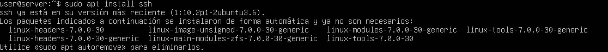

## 1.2 Connexió SSH des de Windows

Des del terminal de Windows executem la comanda:

```bash
ssh user@192.168.56.101
```

En ser la primera connexió, apareix un avís indicant que l'autenticitat de l'equip no és coneguda. Acceptem la clau escrivint `yes` i continuem amb la connexió.

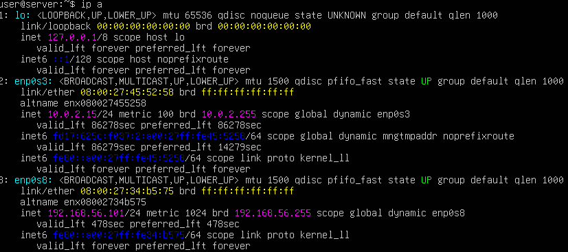

Després d'acceptar la clau, introduïm la contrasenya de l'usuari per completar la connexió remota.

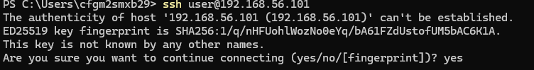

# 2. Actualitzacions del sistema

## 2.1 Comprovació de les actualitzacions

Abans de realitzar l'actualització del sistema, comprovem la situació dels paquets amb les eines d'APT.

També es mostra que el servei SSH ja estava instal·lat i en la seva versió més recent.

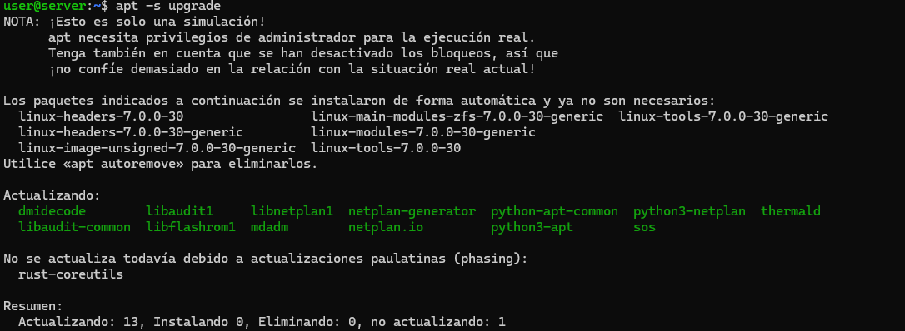

## 2.2 Simulació de l'actualització

Per comprovar què passaria abans de realitzar l'actualització utilitzem:

```bash
apt -s upgrade
```

La comanda realitza una simulació de l'actualització sense modificar el sistema. En el resultat es mostra que hi ha **13 paquets per actualitzar** i no s'hi observa cap conflicte de dependències que impedeixi l'actualització.

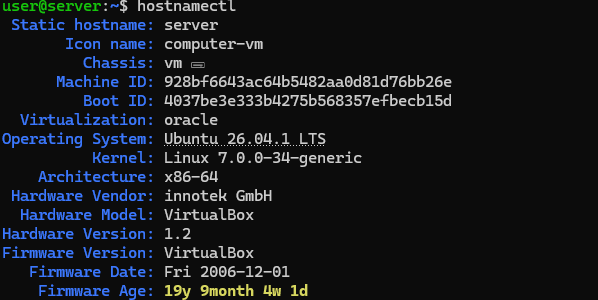

# 3. Canviant el nom de l'equip

## 3.1 Comprovar el nom actual

Executem:

```bash
hostnamectl
```

Inicialment, el nom estàtic de l'equip és `server` i el nom descriptiu és `computer-vm`.

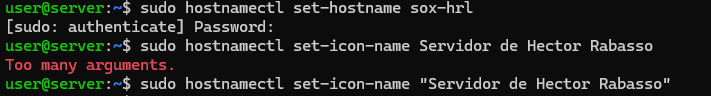

## 3.2 Canviar el nom de l'equip

Canviem el nom de l'equip amb:

```bash
sudo hostnamectl set-hostname sox-hrl
```

A continuació intentem establir el nom descriptiu amb:

```bash
sudo hostnamectl set-icon-name Servidor de Hector Rabasso
```

La primera vegada apareix un error perquè el nom descriptiu conté diversos arguments. Per solucionar-ho, posem el nom entre cometes:

```bash
sudo hostnamectl set-icon-name "Servidor de Hector Rabasso"
```

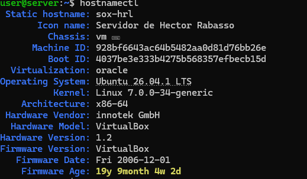

## 3.3 Comprovar la nova configuració

Tornem a executar:

```bash
hostnamectl
```

Ara podem comprovar que el **Static hostname** és `sox-hrl` i que el **Icon name** és `Servidor de Hector Rabasso`.


## 3.4 Comprovar la comanda hostname

Executem:

```bash
hostname
```

El resultat és:

```text
sox-hrl
```

La comanda `hostname` mostra directament el nom actual de l'equip, mentre que `hostnamectl` mostra informació més completa sobre el sistema i la configuració del hostname.

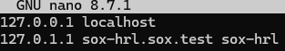

## 3.5 Configuració del fitxer /etc/hosts

Editem el fitxer `/etc/hosts` amb:

```bash
sudo nano /etc/hosts
```

Afegim la correspondència entre l'adreça local i el nom complet de l'equip:

```text
127.0.0.1 localhost
127.0.1.1 sox-hrl.sox.test sox-hrl
```

D'aquesta manera, el sistema pot resoldre correctament el nom de l'equip i el seu domini.

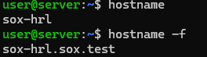

## 3.6 Comprovar hostname i hostname -f

Executem:

```bash
hostname
```

El resultat és:

```text
sox-hrl
```

A continuació executem:

```bash
hostname -f
```

El resultat és:

```text
sox-hrl.sox.test
```

La diferència és que `hostname` mostra únicament el nom de l'equip, mentre que `hostname -f` mostra el **nom de domini complet (FQDN)**.

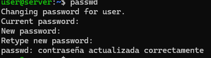

# 4. Canvi de la contrasenya de l'usuari

Per canviar la contrasenya de l'usuari actual executem:

```bash
passwd
```

El sistema ens demana la contrasenya actual i posteriorment la nova contrasenya dues vegades.

El missatge final confirma que la contrasenya s'ha actualitzat correctament.

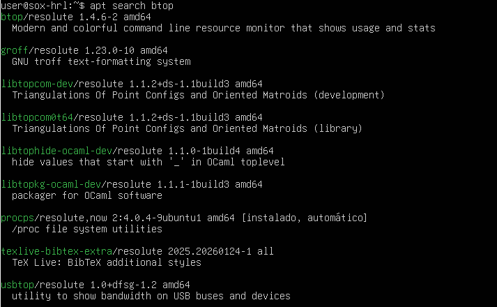

# 5. Gestió de la instal·lació d'aplicacions

## 5.1 Cerca del paquet btop

Primer comprovem si el paquet `btop` existeix als repositoris amb:

```bash
apt search btop
```

El resultat mostra el paquet `btop` disponible als repositoris.

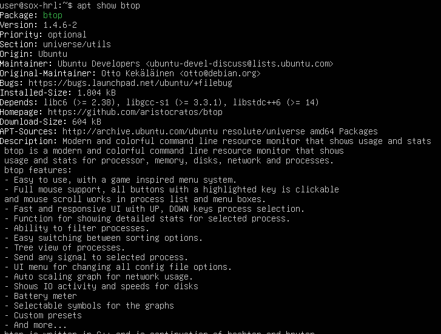

## 5.2 Informació del paquet btop

Consultem la informació del paquet amb:

```bash
apt show btop
```

La informació mostra, entre altres dades:

* **Package:** btop
* **Version:** 1.4.6-2
* **Priority:** optional
* **Section:** universe/utils
* **Origin:** Ubuntu
* **Installed-Size:** 1.804 kB
* **Download-Size:** 604 kB
* **Homepage:** projecte oficial de btop
* **Description:** monitor de recursos de la línia d'ordres.

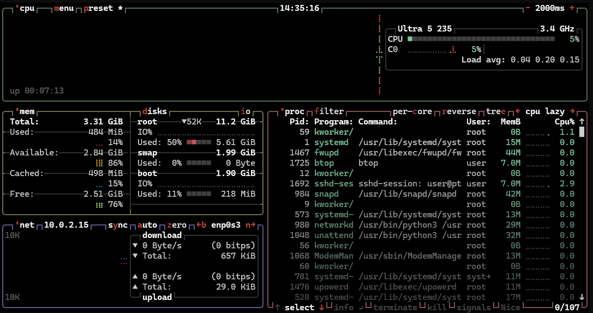

## 5.3 Comprovació del funcionament de btop

Una vegada instal·lat, executem `btop` per comprovar el seu funcionament.

El programa mostra informació en temps real sobre el processador, la memòria, els discos, la xarxa i els processos del sistema.

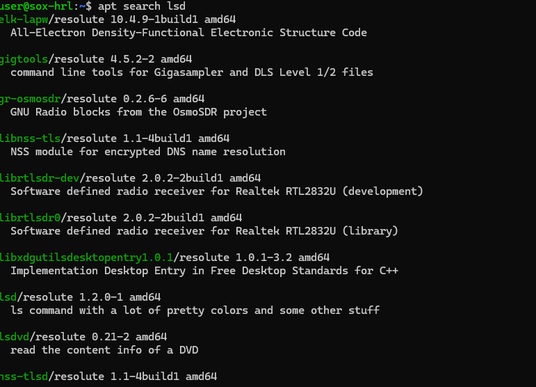

## 5.4 Cerca del paquet lsd

Busquem el paquet `lsd` amb:

```bash
apt search lsd
```

El resultat mostra que el paquet `lsd` està disponible i que és una alternativa a la comanda tradicional `ls`.

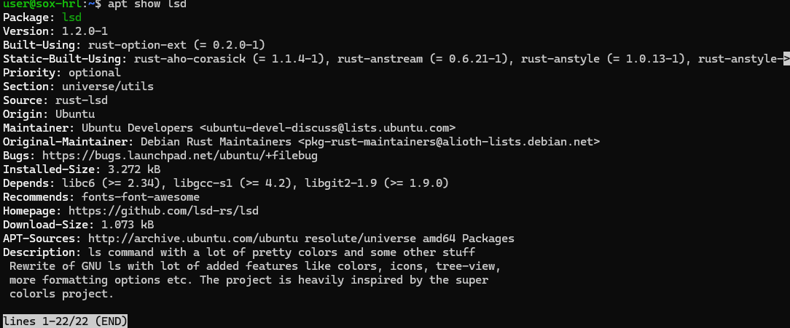

## 5.5 Informació del paquet lsd

Consultem la informació del paquet amb:

```bash
apt show lsd
```

El paquet correspon a una alternativa moderna a `ls`, amb opcions de formatació i colors.

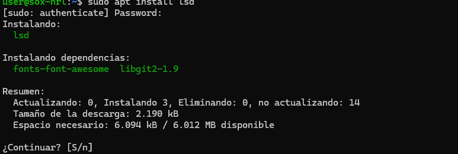

## 5.6 Instal·lació de lsd

Instal·lem el paquet amb:

```bash
sudo apt install lsd
```

El sistema mostra els paquets que s'instal·laran i les dependències necessàries abans de continuar.

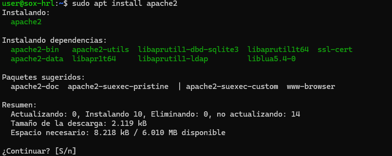

## 5.7 Instal·lació d'Apache2

Instal·lem el servidor web Apache amb:

```bash
sudo apt install apache2
```

El sistema mostra els paquets i les dependències que s'instal·laran.

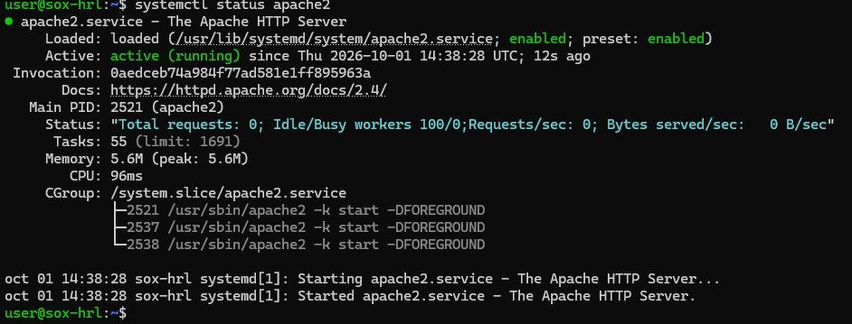

## 5.8 Comprovar l'estat d'Apache2

Una vegada instal·lat, comprovem l'estat del servei amb:

```bash
systemctl status apache2
```

El resultat mostra que el servei està **active (running)** i, per tant, Apache està funcionant correctament.

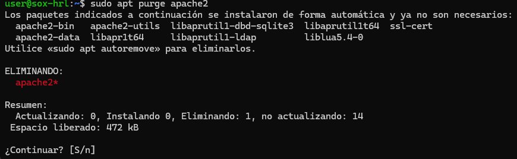

## 5.9 Desinstal·lació d'Apache2

Per eliminar Apache i també els seus fitxers de configuració utilitzem:

```bash
sudo apt purge apache2
```

La comanda mostra que el paquet `apache2` serà eliminat.

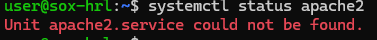

## 5.10 Comprovar que Apache2 ha estat eliminat

Després de la desinstal·lació executem:

```bash
systemctl status apache2
```

El sistema indica:

```text
Unit apache2.service could not be found.
```

Això confirma que el servei Apache2 ja no està instal·lat.

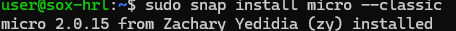

## 5.11 Instal·lació de Micro amb Snap

Instal·lem l'editor `micro` mitjançant Snap:

```bash
sudo snap install micro --classic
```

Després comprovem els paquets Snap instal·lats amb:

```bash
snap list
```

En el resultat apareix el paquet `micro`, indicant que s'ha instal·lat correctament.

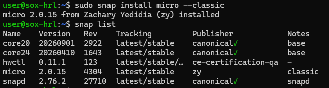

## 5.12 Actualitzar Micro

Executem:

```bash
sudo snap refresh micro
```

Com que el paquet s'acaba d'instal·lar, el sistema indica que no hi ha actualitzacions disponibles.

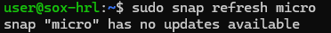

## 5.13 Desinstal·lar Micro

Finalment eliminem Micro amb:

```bash
sudo snap remove micro
```

Després executem:

```bash
snap list
```

El paquet `micro` ja no apareix a la llista, de manera que s'ha eliminat correctament.

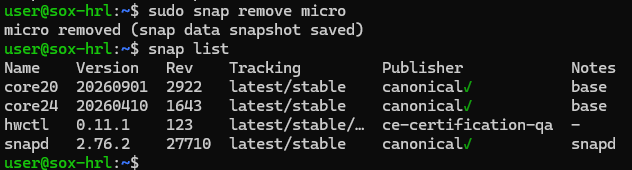

# 6. Configuracions d'hora, teclat i idioma

## 6.1 Comprovar la zona horària actual

Executem:

```bash
timedatectl
```

Inicialment, la zona horària configurada és:

```text
Etc/UTC
```

També podem observar que la sincronització del rellotge està activa.

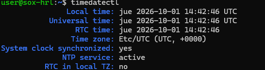

## 6.2 Configurar la zona horària

Canviem la zona horària a Madrid amb:

```bash
sudo timedatectl set-timezone Europe/Madrid
```

Després tornem a executar:

```bash
timedatectl
```

Ara la zona horària és:

```text
Europe/Madrid
```

La sincronització del rellotge continua activa.

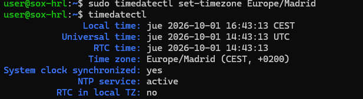

## 6.3 Configuració del teclat

Per configurar el teclat utilitzem:

```bash
sudo dpkg-reconfigure keyboard-configuration
```

Apareix l'assistent de configuració del teclat, on podem seleccionar el model de teclat adequat.

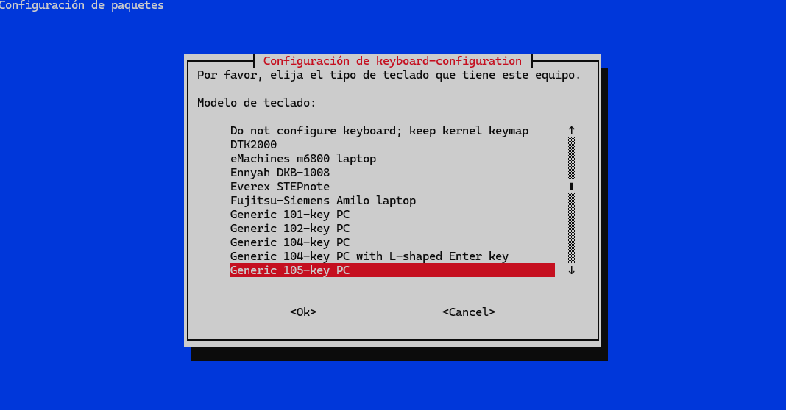

## 6.4 Comprovar la configuració de l'idioma

Executem:

```bash
locale
```

El resultat mostra que el sistema utilitza principalment la configuració regional:

```text
es_ES.UTF-8
```

Aquesta configuració s'aplica a variables com `LANG`, `LC_TIME`, `LC_MESSAGES`, `LC_MONETARY`, entre altres.

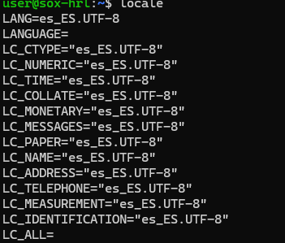

## 6.5 Reconfigurar les locales

Per configurar les locals utilitzem:

```bash
sudo dpkg-reconfigure locales
```

Aquesta eina permet seleccionar i configurar les localitzacions disponibles al sistema.


# 7. Explorant arxius de configuració

## 7.1 Buscar fitxers .yaml

Per localitzar tots els fitxers amb extensió `.yaml` dins de `/etc` utilitzem:

```bash
sudo find /etc -type f -name "*.yaml"
```

El resultat mostra el fitxer:

```text
/etc/netplan/00-installer-config.yaml
```

Aquest és el fitxer de configuració de Netplan que es troba dins de `/etc`.

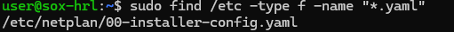

## 7.2 Buscar carpetes relacionades amb SSH

Utilitzem:

```bash
sudo find /etc -type d -name "*ssh*"
```

La comanda localitza diverses carpetes relacionades amb SSH, entre elles:

```text
/etc/ssh
/etc/ssh/ssh_config.d
/etc/systemd/system/ssh.service.requires
/etc/systemd/system/ssh.service.wants
/etc/systemd/system/sshd@.service.wants
```

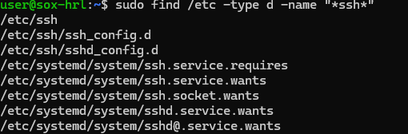

## 7.3 Buscar fitxers grans i mostrar la configuració SSH

La tasca també demana comprovar quins fitxers de `/var/log` ocupen més de 10 MB amb:

```bash
find /var/log -type f -size +10M
```

A la captura no apareix cap fitxer que compleixi aquesta condició.

També es prova de mostrar el contingut de configuració SSH sense comentaris ni línies buides mitjançant `grep`. A la captura, però, la ruta escrita és incorrecta (`/etc/ssh/sshd_conf`) i apareix l'error:

```text
grep: /etc/ssh/sshd_conf: No such file or directory
```

La ruta correcta indicada a l'enunciat és:

```bash
grep -vE '^\s*#|^\s*$' /etc/ssh/sshd_config
```

Per tant, aquesta última comprovació s'hauria de repetir amb la ruta correcta per obtenir el resultat esperat.
